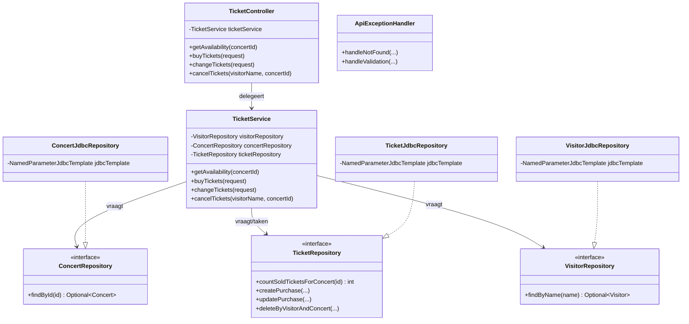

# Verantwoordelijkheden — TicketFaster (Spring Boot)

Deze uitleg hoort bij de studentenvariant van **TicketFaster**: een kleine Spring Boot API om concert-tickets te bekijken, te kopen, te wijzigen en te annuleren.

Lees eerst [Spring Boot als verantwoordelijkheidshiërarchie](spring-boot-als-verantwoordelijkheid.md) (voortzetting van de OOP-filosofie). Gebruik daarna dit document om in *deze* codebase te zien **wie wat weet** en **aan wie iets gevraagd wordt**.

Relatieve links gaan uit van deze `UITLEG.md` in de **root** van het archief/repo (naast de map `Ticket faster/`).

## Lagen in één zin

| Laag | Rol in OOP-taal |
|------|-----------------|
| Controller | Neemt HTTP-vragen aan en delegeert taken aan de service |
| Service | Kent de businessregels; vraagt repositories om data |
| Repository (interface) | Belooft data-vragen/taken (nog zonder SQL) |
| JDBC-repository | Voert die beloften uit tegen de database |
| Model | Draagt domeingegevens (records) |
| DTO | Draagt in-/uitvoer voor de API (niet hetzelfde als model) |
| Exception + handler | Signaleert fouten; vertaalt ze naar HTTP-antwoorden |

Spring Boot zelf: start de applicatie, koppelt objecten aan elkaar (constructor injection), en levert standaardwerk (webserver, JSON, validatie, JDBC, transacties).

---

## TicketfasterApiApplication

Bestand: [`TicketfasterApiApplication.java`](Ticket%20faster/src/main/java/nl/han/ticketfaster/TicketfasterApiApplication.java)

| Categorie | Beschrijving |
|-----------|--------------|
| **Weet zelf** | — (bijna lege startklasse) |
| **Kent** | — |
| **Kan vragen beantwoorden** | — |
| **Kan taken uitvoeren** | Applicatie starten (`SpringApplication.run`) |
| **Delegeert aan** | Spring Boot: component-scan, webserver, wiring van beans |

---

## TicketController

Bestand: [`TicketController.java`](Ticket%20faster/src/main/java/nl/han/ticketfaster/controller/TicketController.java)

| Categorie | Beschrijving |
|-----------|--------------|
| **Weet zelf** | — |
| **Kent** | [`TicketService`](Ticket%20faster/src/main/java/nl/han/ticketfaster/service/TicketService.java) (object-typed field via constructor) |
| **Kan vragen beantwoorden** | HTTP: beschikbaarheid (`GET /tickets/available`) |
| **Kan taken uitvoeren** | HTTP: kopen (`POST /tickets/purchases`), wijzigen (`PUT /tickets`), annuleren (`DELETE /tickets`) |
| **Delegeert aan** | `TicketService` voor alle businesslogica |

**Belangrijk:** de controller kent geen SQL en geen ticketregels. Die verantwoordelijkheid ligt elders.

---

## TicketService

Bestand: [`TicketService.java`](Ticket%20faster/src/main/java/nl/han/ticketfaster/service/TicketService.java)

| Categorie | Beschrijving |
|-----------|--------------|
| **Weet zelf** | Businessregels (o.a. quantity 1–5, geannuleerd concert mag niet, genoeg stoelen?) |
| **Kent** | [`VisitorRepository`](Ticket%20faster/src/main/java/nl/han/ticketfaster/repository/VisitorRepository.java), [`ConcertRepository`](Ticket%20faster/src/main/java/nl/han/ticketfaster/repository/ConcertRepository.java), [`TicketRepository`](Ticket%20faster/src/main/java/nl/han/ticketfaster/repository/TicketRepository.java) |
| **Kan vragen beantwoorden** | Hoeveel tickets zijn verkocht / beschikbaar voor een concert? |
| **Kan taken uitvoeren** | Tickets kopen, wijzigen, annuleren (met validatie) |
| **Delegeert aan** | Repositories voor zoeken/tellen/opslaan; gooit [`NotFoundException`](Ticket%20faster/src/main/java/nl/han/ticketfaster/exception/NotFoundException.java) / [`ValidationException`](Ticket%20faster/src/main/java/nl/han/ticketfaster/exception/ValidationException.java) bij fouten |

---

## Repository-interfaces

### ConcertRepository — [`ConcertRepository.java`](Ticket%20faster/src/main/java/nl/han/ticketfaster/repository/ConcertRepository.java)

| Categorie | Beschrijving |
|-----------|--------------|
| **Weet zelf** | — (alleen contract) |
| **Kent** | — |
| **Kan vragen beantwoorden** | Zoek concert op id → `Optional<Concert>` |
| **Kan taken uitvoeren** | — |
| **Delegeert aan** | Implementatie: [`ConcertJdbcRepository`](Ticket%20faster/src/main/java/nl/han/ticketfaster/repository/jdbc/ConcertJdbcRepository.java) |

### VisitorRepository — [`VisitorRepository.java`](Ticket%20faster/src/main/java/nl/han/ticketfaster/repository/VisitorRepository.java)

| Categorie | Beschrijving |
|-----------|--------------|
| **Kan vragen beantwoorden** | Zoek bezoeker op naam |
| **Kan taken uitvoeren** | Bezoeker aanmaken |
| **Delegeert aan** | [`VisitorJdbcRepository`](Ticket%20faster/src/main/java/nl/han/ticketfaster/repository/jdbc/VisitorJdbcRepository.java) |

### TicketRepository — [`TicketRepository.java`](Ticket%20faster/src/main/java/nl/han/ticketfaster/repository/TicketRepository.java)

| Categorie | Beschrijving |
|-----------|--------------|
| **Kan vragen beantwoorden** | Aantal verkochte tickets voor concert; aankoop zoeken op visitor+concert |
| **Kan taken uitvoeren** | Aankoop aanmaken/wijzigen/verwijderen |
| **Delegeert aan** | [`TicketJdbcRepository`](Ticket%20faster/src/main/java/nl/han/ticketfaster/repository/jdbc/TicketJdbcRepository.java) |

**Waarom een interface?** De service vraagt: “Repository, vind dit concert.” Hij hoeft niet te weten *hoe* (SQL). Dat is dezelfde OOP-gedachte als “Motor, werk jij?” i.p.v. intern in andermans administratie neuzen.

---

## JDBC-implementaties

### ConcertJdbcRepository — [`ConcertJdbcRepository.java`](Ticket%20faster/src/main/java/nl/han/ticketfaster/repository/jdbc/ConcertJdbcRepository.java)

| Categorie | Beschrijving |
|-----------|--------------|
| **Weet zelf** | SQL voor concerts |
| **Kent** | `NamedParameterJdbcTemplate` (Spring levert dit) |
| **Kan vragen beantwoorden** | `findById` tegen tabel `concerts` |
| **Delegeert aan** | JDBC-template / database |

### TicketJdbcRepository — [`TicketJdbcRepository.java`](Ticket%20faster/src/main/java/nl/han/ticketfaster/repository/jdbc/TicketJdbcRepository.java)

| Categorie | Beschrijving |
|-----------|--------------|
| **Weet zelf** | SQL voor `ticket_purchases` |
| **Kent** | `NamedParameterJdbcTemplate` |
| **Kan vragen/taken** | count / find / insert / update / delete |

### VisitorJdbcRepository — [`VisitorJdbcRepository.java`](Ticket%20faster/src/main/java/nl/han/ticketfaster/repository/jdbc/VisitorJdbcRepository.java)

Zelfde patroon voor `visitors`.

---

## Models (domeingegevens)

Records zonder gedrag — vooral “wat weet ik?”:

| Class | Bestand | Weet zelf |
|-------|---------|-----------|
| `Concert` | [`Concert.java`](Ticket%20faster/src/main/java/nl/han/ticketfaster/model/Concert.java) | id, artist, location, year, totalSeats, cancelled |
| `Visitor` | [`Visitor.java`](Ticket%20faster/src/main/java/nl/han/ticketfaster/model/Visitor.java) | id, name, vip, wishes |
| `TicketPurchase` | [`TicketPurchase.java`](Ticket%20faster/src/main/java/nl/han/ticketfaster/model/TicketPurchase.java) | id, visitorId, concertId, quantity |

---

## DTOs (API in/uit)

| Class | Bestand | Rol |
|-------|---------|-----|
| `TicketPurchaseRequest` | [`TicketPurchaseRequest.java`](Ticket%20faster/src/main/java/nl/han/ticketfaster/dto/TicketPurchaseRequest.java) | Invoer kopen/wijzigen + Bean Validation (`@NotBlank`, `@Min`, `@Max`) |
| `TicketAvailabilityResponse` | [`TicketAvailabilityResponse.java`](Ticket%20faster/src/main/java/nl/han/ticketfaster/dto/TicketAvailabilityResponse.java) | Antwoord beschikbaarheid |
| `MessageResponse` | [`MessageResponse.java`](Ticket%20faster/src/main/java/nl/han/ticketfaster/dto/MessageResponse.java) | Eenvoudig tekstantwoord |

DTOs zijn geen “slimme objecten” met taken; ze zijn boodschappen tussen buitenwereld en service.

---

## Exceptions + ApiExceptionHandler

| Class | Bestand | Verantwoordelijkheid |
|-------|---------|----------------------|
| `NotFoundException` | [`NotFoundException.java`](Ticket%20faster/src/main/java/nl/han/ticketfaster/exception/NotFoundException.java) | “Bestaat niet” signaleren |
| `ValidationException` | [`ValidationException.java`](Ticket%20faster/src/main/java/nl/han/ticketfaster/exception/ValidationException.java) | “Mag niet” signaleren |
| `ApiExceptionHandler` | [`ApiExceptionHandler.java`](Ticket%20faster/src/main/java/nl/han/ticketfaster/exception/ApiExceptionHandler.java) | Exceptions → HTTP 404/400 + `MessageResponse` |

De service gooit; de handler vertaalt naar HTTP. Dat is taakverdeling: business zegt *wat* misgaat, de handler zegt *hoe* dat naar buiten klinkt.

---

## Database-schema

- [`schema.sql`](Ticket%20faster/src/main/resources/schema.sql) — tabellen `concerts`, `visitors`, `ticket_purchases`
- [`data.sql`](Ticket%20faster/src/main/resources/data.sql) — startdata
- [`application.yml`](Ticket%20faster/src/main/resources/application.yml) — H2 in-memory, poort 8080, Swagger UI

---

## Delegatieketens

### 1. Beschikbaarheid opvragen
`HTTP GET` → [`TicketController.getAvailability`](Ticket%20faster/src/main/java/nl/han/ticketfaster/controller/TicketController.java) → [`TicketService.getAvailability`](Ticket%20faster/src/main/java/nl/han/ticketfaster/service/TicketService.java) → `ConcertRepository.findById` → `TicketRepository.countSoldTicketsForConcert` → DTO terug

### 2. Tickets kopen
`HTTP POST` → Controller `buyTickets` → Service: valideer quantity → zoek Visitor → zoek Concert → check niet geannuleerd → check voorraad → `TicketRepository.createPurchase`

### 3. Foutpad “niet gevonden”
Service gooit `NotFoundException` → [`ApiExceptionHandler`](Ticket%20faster/src/main/java/nl/han/ticketfaster/exception/ApiExceptionHandler.java) → HTTP 404 + message

### 4. Ongeldige JSON-body
Spring Validation op DTO → `MethodArgumentNotValidException` → handler → HTTP 400

---

## Klassendiagram (lagen)

---

## Wat Spring Boot “standaard” voor je doet (kort)

| Behoefte | Wie / wat |
|----------|-----------|
| HTTP + JSON | `spring-boot-starter-web` |
| Validatie-annotaties op DTO | `spring-boot-starter-validation` |
| JDBC-template | `spring-boot-starter-jdbc` + H2 |
| Objecten aan elkaar geven | constructor injection (`@Service`, `@Repository`, `@RestController`) |
| Transacties | `@Transactional` op de service |
| API-docs UI | springdoc → `/swagger-ui.html` |

Jij schrijft vooral: **wie is verantwoordelijk voor welke vraag/taak?** Spring vult de infrastructuur in.

---

## Verken-tips voor studenten

1. Start bij [`TicketController`](Ticket%20faster/src/main/java/nl/han/ticketfaster/controller/TicketController.java): welke methoden bestaan, wat delegeert elk?
2. Volg één pad (bijv. kopen) tot in de JDBC-class.
3. Zet een breakpoint in de service en in de repository: zie de call stack als hiërarchie.
4. Open Swagger en roep endpoints aan; kijk wat er gebeurt bij foutieve input.
5. Let op: dit is een **student-buggy** variant (`ticketfaster-api-student-buggy` in [`pom.xml`](Ticket%20faster/pom.xml)). Vergelijk bedoelde businessregels met de code (bijv. berekening van beschikbare stoelen in `getAvailability`).

